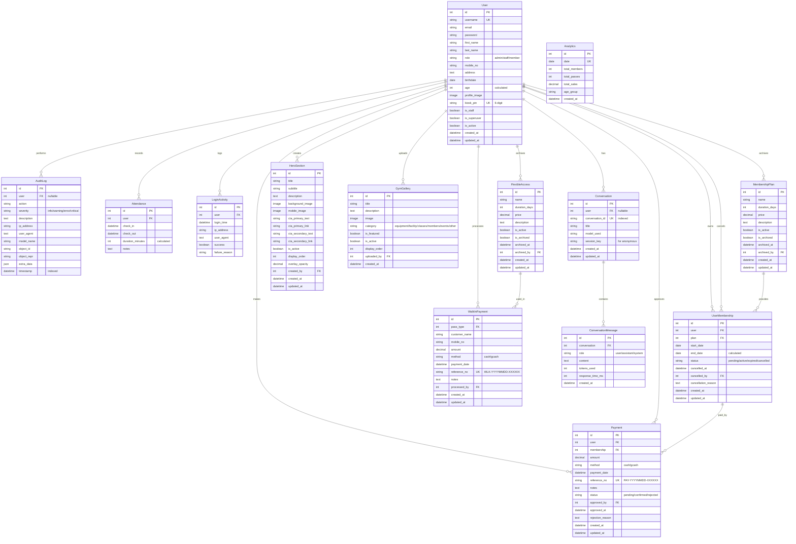
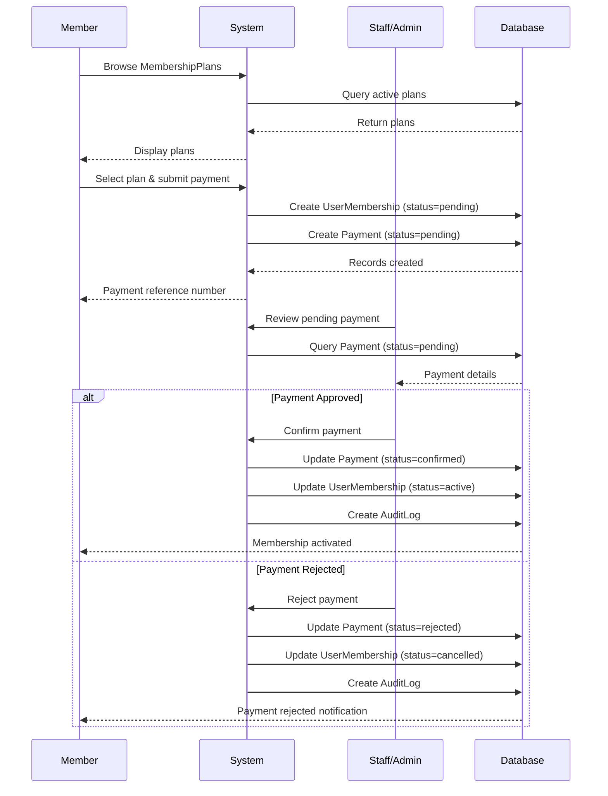
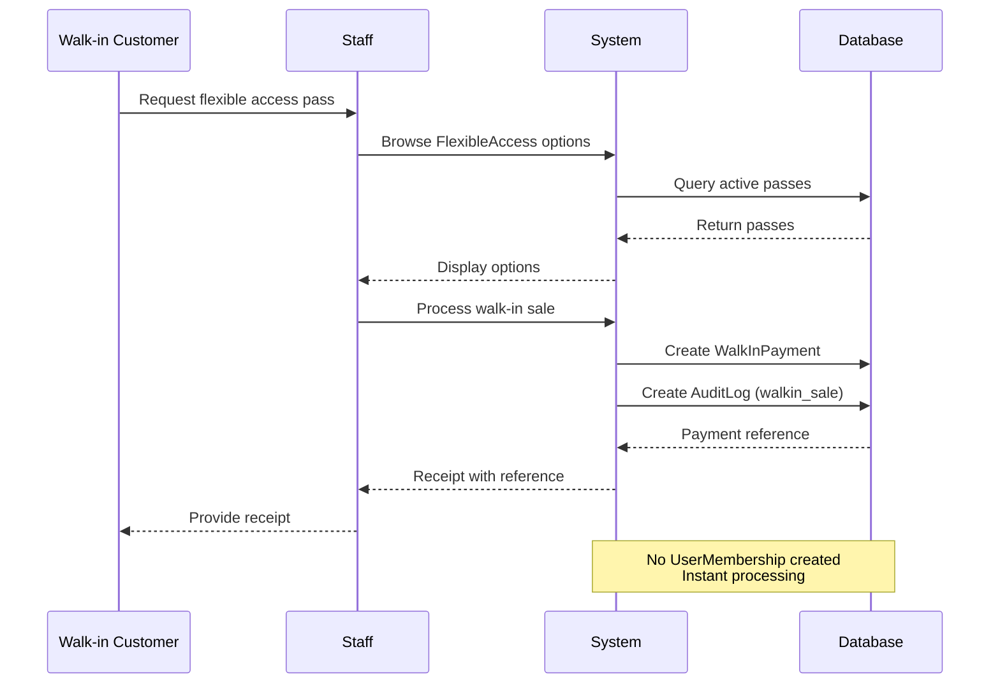
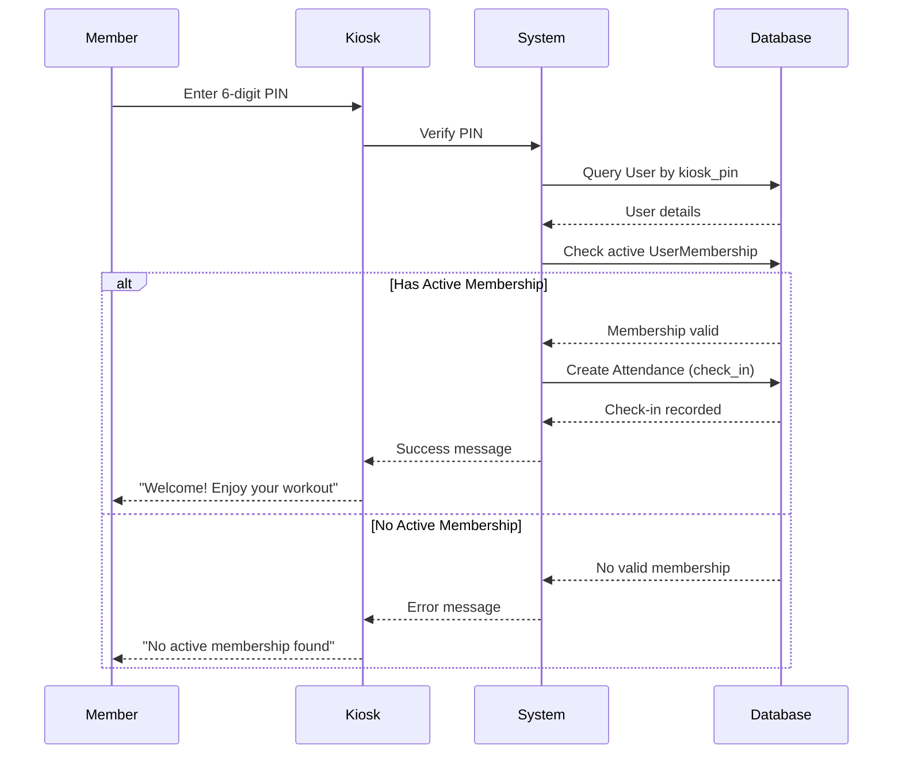
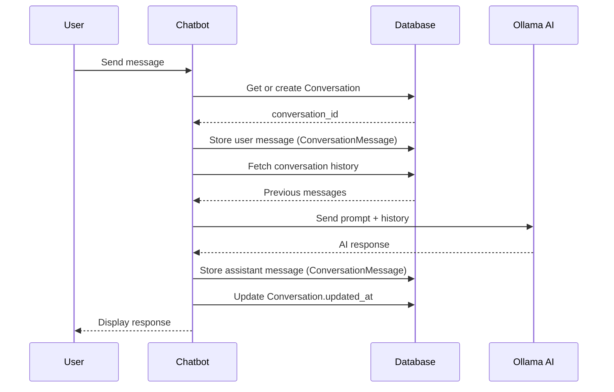
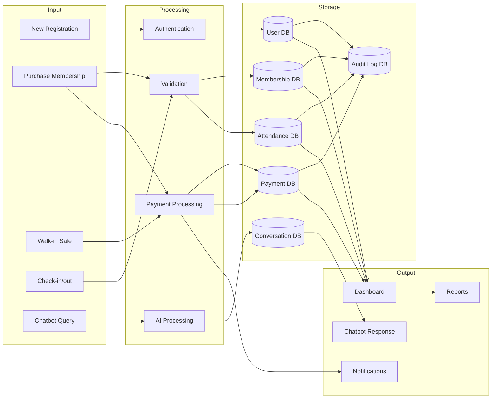

# Visual Entity Relationship Diagram
## Gym Membership Chatbot System

This diagram can be rendered using Mermaid visualization tools.

---

## ERD Diagram (Mermaid)

---

## Simplified View - Core Business Logic

```mermaid
graph TB
    subgraph "User Management"
        U[User]
        U --> |role| ROLE[Admin/Staff/Member]
    end

    subgraph "Membership System"
        MP[MembershipPlan]
        UM[UserMembership]
        U --> |subscribes| UM
        MP --> |used by| UM
        UM --> |status| ST[Pending/Active/Expired/Cancelled]
    end

    subgraph "Payment Processing"
        P[Payment - Members]
        WP[WalkInPayment - Walk-ins]
        UM --> |requires| P
        FA[FlexibleAccess] --> |purchased as| WP
        P --> |status| PS[Pending/Confirmed/Rejected]
    end

    subgraph "Attendance & Access"
        AT[Attendance]
        U --> |check-in/out| AT
        UM --> |enables| AT
    end

    subgraph "Chatbot System"
        CV[Conversation]
        CM[ConversationMessage]
        U --> |interacts via| CV
        CV --> |contains| CM
    end

    subgraph "Analytics & Audit"
        AN[Analytics]
        AL[AuditLog]
        LA[LoginActivity]
        U --> |tracked in| AL
        U --> |tracked in| LA
        UM -.aggregated to.-> AN
        WP -.aggregated to.-> AN
    end

    subgraph "Content Management"
        HS[HeroSection]
        GG[GymGallery]
        U --> |manages| HS
        U --> |manages| GG
    end

    style U fill:#4A90E2
    style UM fill:#50C878
    style P fill:#FFD700
    style AT fill:#FF6B6B
    style CV fill:#9B59B6
    style AN fill:#34495E
```

---

## Workflow Diagrams

### Membership Purchase Flow

### Walk-in Purchase Flow

### Member Check-in Flow

### Chatbot Conversation Flow

---

## Data Flow Overview

---

## Key Constraints & Rules

### Database Constraints
- **Unique Constraints**: username, email, kiosk_pin, reference_no, conversation_id
- **Foreign Key Protections**: MembershipPlan and FlexibleAccess use PROTECT (prevent deletion if in use)
- **Cascading Deletes**: User deletion cascades to memberships, payments, attendance
- **Null Constraints**: Most relationships allow NULL for soft references (approved_by, cancelled_by, etc.)

### Business Rules
1. **Only one active membership** per user at a time (enforced at application level)
2. **Payment must be confirmed** before membership activation
3. **Expired memberships automatically updated** by scheduled task
4. **Kiosk access requires** valid kiosk_pin AND active membership
5. **Archived plans** cannot be purchased but remain in records
6. **Audit logs** created for all critical operations (immutable)
7. **Walk-in payments** processed immediately (no approval needed)
8. **Conversation history** preserved for all users (including anonymous)

---

## Index Strategy

### High-Traffic Indexes
1. **AuditLog**: timestamp, user+timestamp, action+timestamp
2. **Attendance**: check_in, user+check_in
3. **LoginActivity**: user+login_time
4. **Conversation**: conversation_id, user+updated_at
5. **ConversationMessage**: conversation+created_at

### Lookup Indexes
- User.username (unique)
- User.kiosk_pin (unique)
- Payment.reference_no (unique)
- WalkInPayment.reference_no (unique)
- Analytics.date (unique)

---

**Generated**: 2025-12-02
**Database**: PostgreSQL/MySQL (Django ORM Compatible)
**Framework**: Django 4.x+
